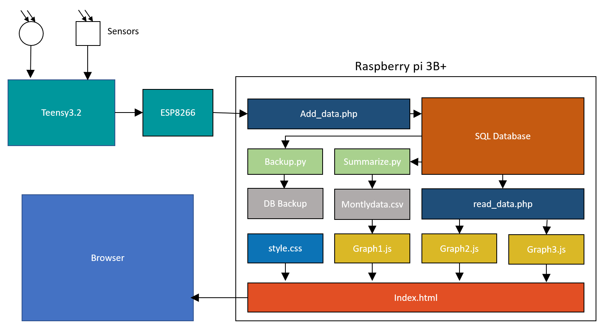
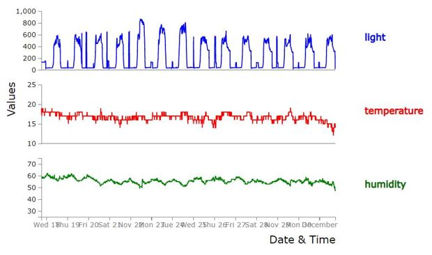
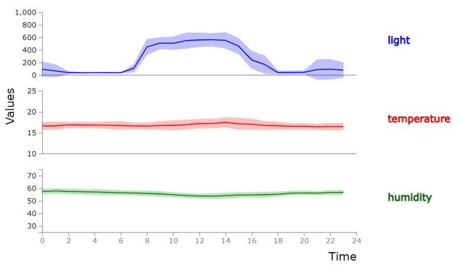
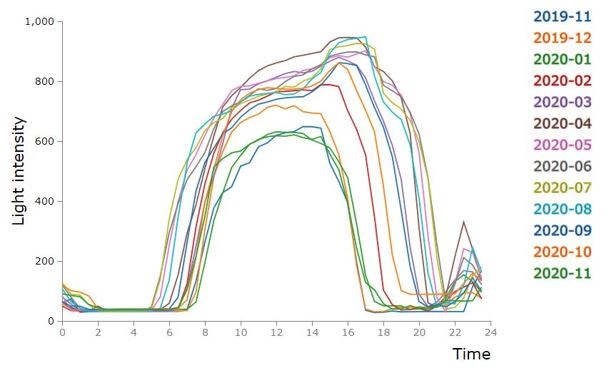
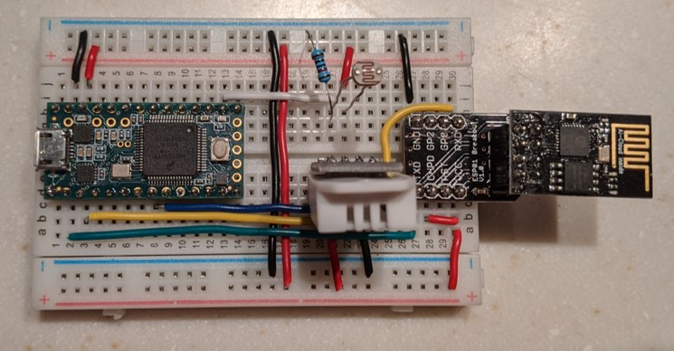

# WeatherStation

In this project I built an Arduino/Raspberry Pi-powered weather station that displays the collected data in a local browser. In this project, I used many tools for the first time, which was part of the goal. I wanted to learn a lot of new things while having fun. I ended up with a functional product and a lot of new knowledge, which I will present to you in this repo. Because my goal was to learn to use some of the tools I used here, this is most likely not the most efficient way to build what I built. If you are looking for an optimized (both performance and cost) weather station, this is not your best source. That said, I hope you enjoy my content and join me in learning to use some new things.

Tools I used include:
* Arduino / Teensy
  * Sensors
  * AT Commands
* Raspberry Pi (Unix-like)
  * Database
    * SQL
    * Python
    * Php
  * Website
    * html
    * D3.js / Javascript
    * CSS

Disclaimer: Because most of this stuff was new to me, I used a lot of different tutorial I could find online (discussion fora, youtube, blogs etc.). For many steps I consulted and combined several tutorials and I likely don't remember all the sources. Where possible I will point you to the tutorials I used. To enhance my learning, I tried to re-write most of the code, but it is possible you recognize some signature of others.

## Overview
Here is a rough outline of information flow in the project.

#### Sensors
The sensors (I used light, temperature and humidity) are all connected to a microcontroller (I used Teensy3.2). The Teensy reads the sensors, then uses an ESP8266 module to wirelessly send the data to the server. The goal for this part was to be modular. Without much change to the code or circuit, you should be able to add more or different sensors. The system is also not limited to a single sensor-circuit. You can add as many as you want.

##### Database
The data are stored on a Raspberry pi server (I used the 3b+ model). When sensor data is sent, the add_data.php script adds it to the database with a timestamp. The server also runs some scheduled python scripts using crontab to backup the database and summarize the data with monthly averages.

##### Displaying the data
The data are displayed in a webpage that is hosted on the raspberry pi. I have not made the page public, but as long as you're in my WiFi network you can load the page from any browser on any device. I have created 3 graphs using D3.js, but of course you can add as many different graphs as you'd like.


<!--   
{:height="700px" width="400px"}  
   -->

In this first graph I display the raw data from the last 14 days. You can clearly see a daily pattern in light and humidity. This was during winter so we had our windows mostly closed, and the bedroom is not heated, therefore there is not much of a temperature change during this time.   


Here I have averaged the data from the last 2 weeks to show the values across an average day, as well as the variation (SE) between those days.  


In this last graph, I display the average daily light pattern for each month during a full year of data recording. You can see beautiful seasonal patterns with more hours of daylight and higher light intensity during summer compared to winter. The "bump" around 3pm is because our windows are facing west, and around that time we get more direct sunlight in our room. The smaller peak around 11pm is from us using artificial light while getting ready to sleep.   



<br>

# Set up
Here I posted some instruction and tutorial on how to set up a weatherstation yourself  

## Arduino-side

#### Hardware (Parts and connections)
I started using an Arduino, but I switched to a [Teensy3.2](https://www.pjrc.com/store/teensy32.html), mainly because it appeared more stable with the WiFi module. To work with Teensy from your Arduinio IDE you'll have to install [Teensyduino](https://www.pjrc.com/teensy/td_download.html). After you have been through the installation process it will work just like an arduino.

To connect each sensor and the wifi module I followed instructions of each separately.
1. I used the [DHT 22 temperature and humidity sensor](https://learn.adafruit.com/dht). Besides [this adafruit](https://learn.adafruit.com/dht/connecting-to-a-dhtxx-sensor) tutorial, I also used [this](https://www.youtube.com/watch?v=oi_GPSLjgBY&ab_channel=Robojax) video tutorial on how to connect is and use the DHT.h library.
2. I used an analog photoresistor with the analog read on the Teensy. You can find a tutorial [here](https://learn.adafruit.com/photocells/using-a-photocell).  
3. I used the [Esp8266](https://www.amazon.com/gp/product/B01EA3UJJ4/ref=ppx_yo_dt_b_search_asin_title?ie=UTF8&psc=1) WiFi module with [breakout board](https://www.amazon.com/gp/product/B01G6HK3KW/ref=ppx_yo_dt_b_search_asin_title?ie=UTF8&psc=1).

Here is a picture of my final setup.


#### Software
### Install Aruidno IDE
I had to include "[DHT sensor library](https://github.com/adafruit/DHT-sensor-library)" and "[Adafruit Unified Sensor](https://github.com/adafruit/Adafruit_Sensor)" both by Adafruit

### Upload code
[this video](https://www.youtube.com/watch?v=xGH2XmJy1co)

## Raspberry Pi-side
Some useful tools to install on your PC first:
- Swish (to talk to your RPi without monitor)
- Tera Term (to talk to command line)

### To set up Raspberry Pi as web server we need to install:
- linux (Raspbian)
- Apache
- MySQL
- PHP
- SSH

If you don't know how to do that, there are good instructions out there, for example, follow instructions in this video:
[Setup a Raspberry Pi Web Server](https://www.youtube.com/watch?v=vzojwG7OB7c)

Don't forget to add "ssh" before booting your Pi

### On your RPi
Update existing software:
```
sudo apt-get update
sudo apt-get upgrade
```
[Install new stuff](https://howtoraspberrypi.com/how-to-install-web-server-raspberry-pi-lamp/):
```
sudo apt install apache2
sudo apt install php php-mbstring
sudo apt install mariadb-server php-mysql mariadb-client
```
Set up MySQL user/password:
"Root"/"****"

in browser confirm it works by typing in IP-address of RPi
Change permissions:
```
sud0 chmod 777 -R /var/www

sudo phpenmod mysqli
sudo service apache2 restart

with help from
https://randomnerdtutorials.com/raspberry-pi-apache-mysql-php-lamp-server/
and
https://randomnerdtutorials.com/esp32-esp8266-raspberry-pi-lamp-server/
https://randomnerdtutorials.com/esp32-esp8266-mysql-database-php/

```

 with help from [this video](https://www.youtube.com/watch?v=N7c8CMuBx-Y)
- Install Raspbian (with Win32DiskImager)


### set up databae
localhost/phpmyadmin (Php myadmin?)

```
mysql -u root -p

CREATE DATABASE WeatherDataBase;

USE WeatherDataBase;

CREATE TABLE Sources(
SourceID INT(6) NOT NULL AUTO_INCREMENT,
SourceName VARCHAR(20),
PRIMARY KEY(SourceID)
);

CREATE TABLE Measures(
MeasureTypeID INT(6) NOT NULL AUTO_INCREMENT,
MeasureType VARCHAR(20),
PRIMARY KEY(MeasureTypeID)
);

CREATE TABLE Locations(
LocationsID INT(6) NOT NULL AUTO_INCREMENT,
LocationName VARCHAR(20),
PRIMARY KEY(LocationsID)
);

CREATE TABLE EnvironmentalData (
MeasurementID INT(6) NOT NULL AUTO_INCREMENT,
DateTime DATETIME,
Source INT(6) REFERENCES Sources(SourceID),
Location VARCHAR(20) REFERENCES Locations(LocationsID),
Measurment VARCHAR(20) REFERENCES Measures(MeasureTypeID),
Value DECIMAL(2,1),
PRIMARY KEY(MeasurementID)
);

CREATE TABLE EnvironmentalData (
MeasurementID INT(6) NOT NULL AUTO_INCREMENT,
DateTime TIMESTAMP,
Source INT(6) REFERENCES Sources(SourceID),
Location INT(6) REFERENCES Locations(LocationsID),
Measurement INT(6) REFERENCES Measures(MeasureTypeID),
Value DECIMAL(3,1),
PRIMARY KEY(MeasurementID)
);

to test:
show tables;
desc EnvironmentalData;
```

## Website to load data
```
SELECT * FROM EnvironmentalData WHERE Location="Bedroom";
SELECT * FROM EnvironmentalData WHERE 'Date' > "2019-11-01";
```

GRANT EXECUTE on WeatherDataBase.* TO 'website'@'%';
